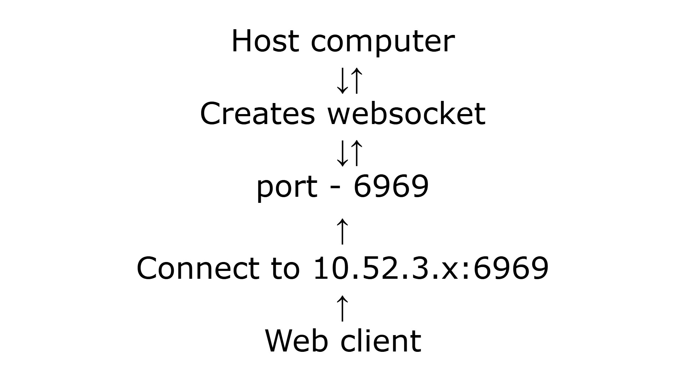
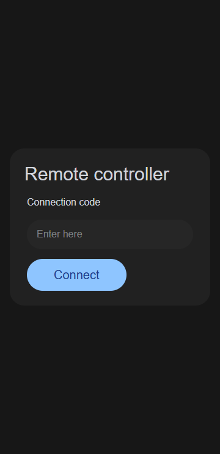
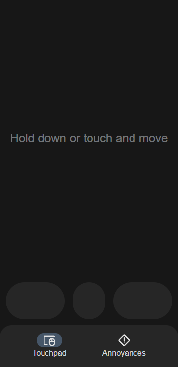
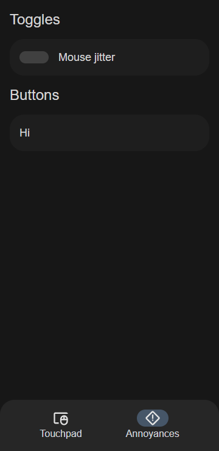

# WebSocket Remote Control

A system for remotely controlling your computer functions using WebSockets. This project uses Python as the host and Vue.js as the client.

## Features

- Control mouse movements remotely
- Simple connection code system
- Responsive SolidJS web interface
- Multi clients support
- And more!

## How do i run it?

> NOTE: The download for Host.exe and Client.exe are located at the releases tab

### Host (Windows 10 / 11)

1. Run `Host.exe`
2. Enter the connection code provided by the notification into your client
3. Now you're ready to control your PC with your browser

### Client (Chrome / Firefox based)

1. Open `Client.html` on your browser
2. Enter the connection code provided by the `Host.exe` in the textbox
3. Now you're ready to control your PC with your browser

## Connection visualization

## Image preview

### Client new (Code, Mouse Control)

On the client you can put in the code provided to connect to the host.

### Old Version

